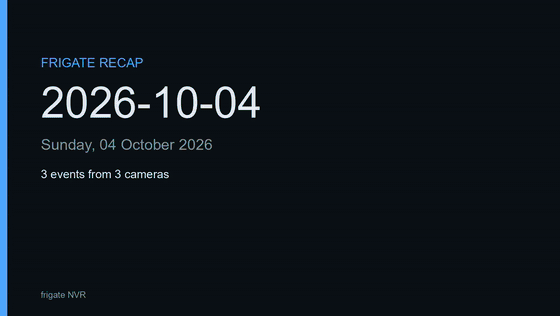
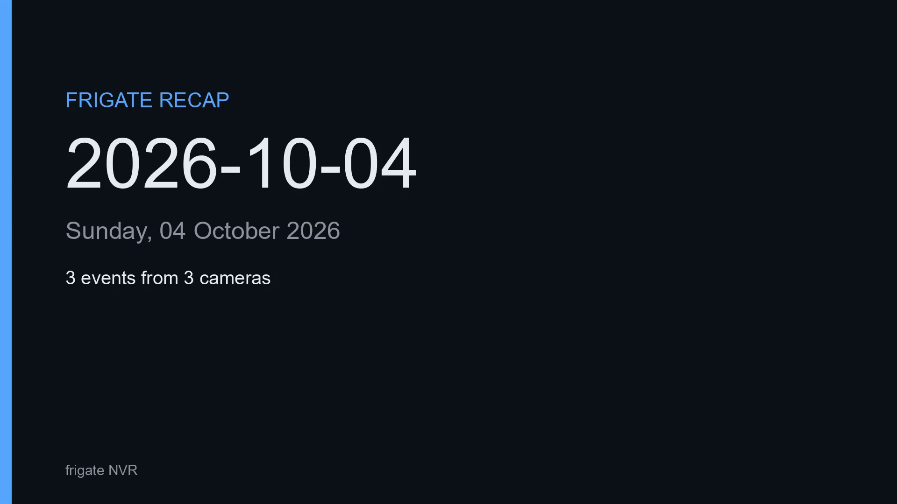
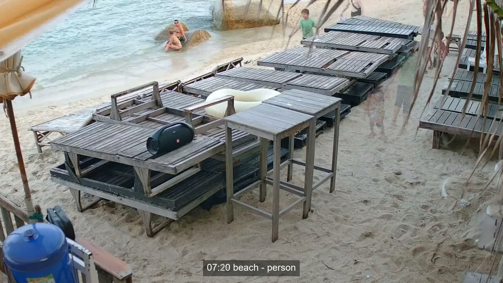
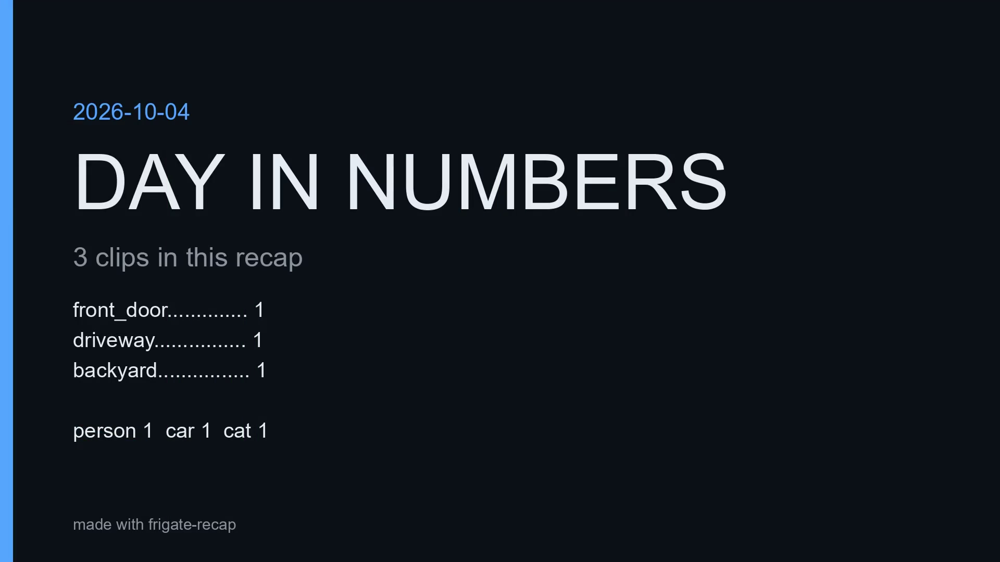

# frigate-recap

[](https://github.com/Booyaka101/frigate-recap/actions/workflows/ci.yml)
[](LICENSE)

Turn one day of [Frigate](https://frigate.video) NVR events into a single digest MP4: a title card, every event clip normalized and burned with a `HH:MM camera - label` lower third, crossfades between clips, and a stats end card. Built to run from cron.



That is real footage from Frigate's public demo instance, rendered by this tool. Run the same thing yourself (the demo keeps a few days of footage, so pick a recent day):

```console
$ export FRIGATE_URL=https://demo.frigate.video
$ frigate-recap --day 2026-10-04 --tz UTC --camera beach --label person \
    --min-score 0.84 --max-clip-seconds 3 --out recaps
wrote recaps/recap-2026-10-04.mp4 (23.4s, stats source: summary)
done: 8 clips, 0 skipped, 18s wall
```

The full 23-second video from the GIF is attached to the [v0.1.3 release](https://github.com/Booyaka101/frigate-recap/releases/tag/v0.1.3) as `sample-recap-2026-10-04.mp4`.

The GIF is an excerpt; the frame below is full resolution. The title and end cards shown are from the walkthrough example further down.

| Title card | Lower third (demo footage) | End card |
|---|---|---|
|  |  |  |

## Why

Frigate records each detection as its own short clip. Reviewing a day means clicking through dozens of files, and there is no built-in way to see the day as one video. The feature has been requested since [2019](https://github.com/blakeblackshear/frigate/issues/54) ("Something like this would be incredible." is the maintainer's own words on the pinned issue), came up again in [2026](https://github.com/blakeblackshear/frigate/issues/23886), and the maintainers' answer has been that this belongs in [a separate repo that uses the API](https://github.com/blakeblackshear/frigate/discussions/7519). That is this repo.

## Requirements

- Python 3.12+
- `ffmpeg` and `ffprobe` on `PATH` (Debian/Ubuntu: `apt install ffmpeg`, macOS: `brew install ffmpeg`, Windows: `winget install Gyan.FFmpeg`). The Docker image includes them.
- A Frigate server, 0.14 through 0.18. The clip route is confirmed against the server's own OpenAPI (`/api/openapi.json`, falling back to `/openapi.json`) before the first download, so point releases that move it keep working.

## Install

```console
$ git clone https://github.com/Booyaka101/frigate-recap
$ cd frigate-recap
$ uv sync            # or: pip install .
$ uv run frigate-recap --version
frigate-recap 0.1.0
```

Or build the container, which needs nothing but Docker:

```console
$ docker build -t frigate-recap .
$ docker run --rm -e FRIGATE_URL=https://frigate.lan -e TZ=Europe/London \
    -v "$PWD/recaps:/data" frigate-recap --day 2026-10-04 --out /data
```

A release workflow publishes the image to `ghcr.io/booyaka101/frigate-recap` when a version tag is pushed.

## Usage

```
frigate-recap --day YYYY-MM-DD [--camera NAME] [--label A,B] [--zone NAME]
              [--min-score 0.7] [--max-clip-seconds 15] [--out DIR] [--plan]
              [--tz ZONE] [--font PATH] [--base-url URL]
```

- `--day` is a local calendar day. Events belong to the day they **start** in, so an event from 23:59 to 00:05 lands in the day it began. Defaults to yesterday, which is what a cron job wants.
- `--label a,b` takes a comma list. `--min-score` filters on `data.score`. `--zone` matches events that entered the zone.
- `--max-clip-seconds` caps each clip (default 15). A clip shorter than the 0.4s crossfade window is skipped and reported.
- `--tz` sets the IANA timezone for the day window and the lower-third clock. Default is the machine's own zone; containers usually want this flag (`--tz Europe/London`) or the `TZ` environment variable.
- `--plan` prints the whole render as JSON and exits: segments, durations, lower thirds, the exact ffmpeg filter graphs, skipped reasons. It fetches data but writes nothing, renders nothing.

Before committing to a big render, look at what you would get:

```console
$ frigate-recap --day 2026-10-04 --camera beach --label person --min-score 0.84 --plan
{
  "day": "2026-10-04",
  "stats": {"events": 8, "cameras": 1, "source": "summary"},
  "segments": [
    {"kind": "title", "duration": 1.5, "duration_is_estimate": false, "lower_third": null},
    {"kind": "clip", "duration": 3.0, "duration_is_estimate": true,
     "lower_third": "07:19 beach - person", "camera": "beach", "label": "person"},
    {"kind": "end", "duration": 1.5, "duration_is_estimate": false, "lower_third": null}
  ],
  "xfade_seconds": 0.4,
  "joins": 8,
  "total_duration": 26.4,
  "duration_basis": "event end-start from the API; rendered clips may run longer when pre/post capture applies",
  "note": "plan only: nothing was written and nothing was rendered"
}
```

Plan durations come from event metadata. Real Frigate clips include pre/post capture, so a rendered recap can run longer than the plan says.

`--out` receives `recap-YYYY-MM-DD.mp4` and `recap-YYYY-MM-DD.json`. The manifest records every included event (id, camera, label, zones, times, score) and every skipped one with a reason (`has_clip false`, `event still in progress`, `clip download failed after retries`, ...), plus per-camera counts, the stats source and the ffmpeg version:

```json
{
  "day": "2026-10-04",
  "timezone": "local",
  "stats": {"events": 3, "cameras": 3, "source": "summary"},
  "included": [
    {"id": "1791382353.012345-abc123", "camera": "front_door", "label": "person",
     "zones": ["front_door_steps"], "duration_seconds": 7.2, "clip_seconds": 7.2,
     "score": 0.91}
  ],  "skipped": [],
  "per_camera": {"front_door": {"included": 1, "skipped": 0}},
  "output": {"duration_seconds": 23.9, "expected_duration_seconds": 23.9,
             "width": 1920, "height": 1080, "fps": 30}
}
```

`duration_seconds` is what probed off the finished file; `expected_duration_seconds` is what the plan formula predicted. If those two ever drift apart, the manifest is where you look first. Per event, `duration_seconds` is the API's own length and `clip_seconds` is what made the cut after the `--max-clip-seconds` clamp.

### Exit codes

| Code | Meaning |
|---|---|
| 0 | A recap was written (even a quiet-day card, even with some clips skipped) |
| 1 | Error: bad arguments, all clips failed, ffmpeg missing, unexpected response |
| 2 | `auth failed: HTTP 401/403`, or the API is unreachable |

### A quiet day is not an error

A day with no events still produces `recap-YYYY-MM-DD.mp4`: a 5 second quiet-day card. Cron jobs get a file and exit 0 either way; the manifest tells you it was empty.

## How a recap is built

1. `GET /api/events` for the day window (paginated, deduplicated), then every filter is applied again client-side so ordering and day assignment do not depend on server defaults.
2. Title card (1.5s): date and event/camera counts from `GET /api/events/summary`.
3. Each clip is downloaded (four at a time, with retries) and probed, then normalized to **1920x1080 at 30 fps** (scaled to fit, padded with black, never cropped) and burned with its lower third. Clips without an audio track get a generated silent stereo track so every segment is uniform.
4. All segments are joined with 0.4s crossfades (`xfade` + `acrossfade`), followed by a stats end card (1.5s).

Total duration = title 1.5 + sum of clip durations + end 1.5, minus 0.4 per join. The three-clip example above: 1.5 + 22.5 + 1.5 - 4 x 0.4 = **23.9s**.

## Configuration

| Environment | Meaning |
|---|---|
| `FRIGATE_URL` | Base URL of the server (or `--base-url`) |
| `FRIGATE_API_KEY` | Sent as `x-api-key`, the pattern for reverse proxies in front of Frigate |
| `FRIGATE_TOKEN` | Sent as `Authorization: Bearer ...`, for Frigate's own login JWT (port 8971) |
| `FRIGATE_RECAP_FONT` | TrueType font for the cards (or `--font`) |
| `FRIGATE_RECAP_FFMPEG` / `FRIGATE_RECAP_FFPROBE` | Binary paths if not on `PATH` |

Frigate's unauthenticated internal port (5000) needs no auth at all; the authenticated port (8971) wants `FRIGATE_TOKEN` from `POST /api/login`.

### Cron

```cron
15 0 * * *  FRIGATE_URL=https://frigate.lan frigate-recap --out /var/recaps >> /var/log/frigate-recap.log 2>&1
```

Progress goes to stdout, errors to stderr, one line each. A run never leaves a half-written recap: work happens in a temp directory and the output file appears complete.

## Limitations

- Timezone: the day window and the `HH:MM` stamps use the machine's zone unless `--tz` is given. In a container set `TZ` or pass `--tz`.
- The title-card counts come from `/api/events/summary` and follow `--camera`/`--label` but not `--zone` (summary rows cannot be zone-filtered reliably).
- Real Frigate clips include pre/post capture, so two events close together can share a little footage.
- Servers that ignore `offset` paging cap a run at 500 events; the manifest carries a note when that happens.
- A camera or label containing `%{` triggers drawtext's text expansion; the run logs a warning. Lower thirds are otherwise injected through `textfile=` and cannot break the filter graph.

## Development

```console
$ uv sync --extra dev
$ uv run pytest -q
..............
46 passed
```

The suite runs against a mock Frigate (FastAPI) with fixture events shaped like a real server's. End-to-end tests render real video with ffmpeg; they skip cleanly when ffmpeg is absent. CI runs the suite on Ubuntu and Windows and builds the image.

## Companion tool

If your problem is disk space rather than review time, [frigate-tier](https://github.com/Booyaka101/frigate-tier) moves old recording segments onto a NAS and keeps them playable in the Frigate UI. The two compose cleanly: frigate-tier archives continuous recordings and previews, while frigate-recap reads event clips over the API, so neither tool touches what the other manages. A typical setup runs both from cron: tier old footage off the fast disk nightly, render yesterday's digest at 00:15.

## License

MIT. Frigate itself is unrelated to this project; this tool only speaks its HTTP API.
